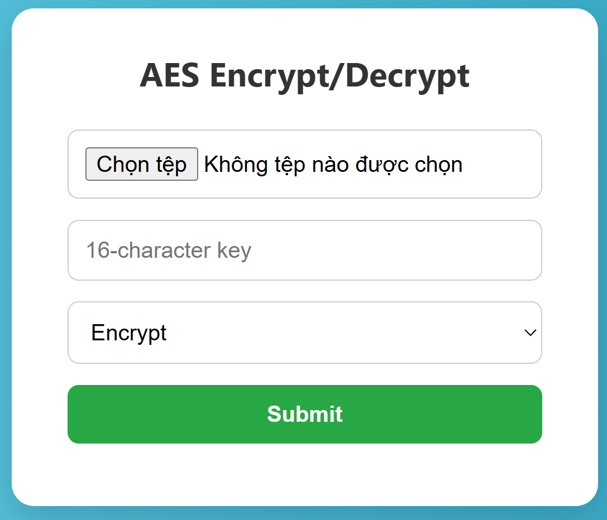

# ThuatToanAES
Một ứng dụng web đơn giản cho phép **mã hóa** và **giải mã** file sử dụng thuật toán **AES (Advanced Encryption Standard)**. Ứng dụng hỗ trợ giao diện web trực quan với Flask và có thể chạy dễ dàng trên Google Colab.

---

## 🚀 Chức năng chính

- ✅ **Mã hóa (Encrypt)**: Tải lên một file và nhập khóa 16 ký tự để mã hóa file đó bằng AES-128.
- ✅ **Giải mã (Decrypt)**: Tải lên file đã mã hóa cùng với khóa gốc để khôi phục lại nội dung ban đầu.
- ✅ **Giao diện web thân thiện**: Giao diện HTML chia thành hai trang riêng biệt: Encrypt và Decrypt.
- ✅ **Tích hợp trên Google Colab** bằng ngrok.

---

## 🖼️ Giao diện

### 🔒 Giao diện mã hóa:

### 🔓 Giao diện giải mã:

